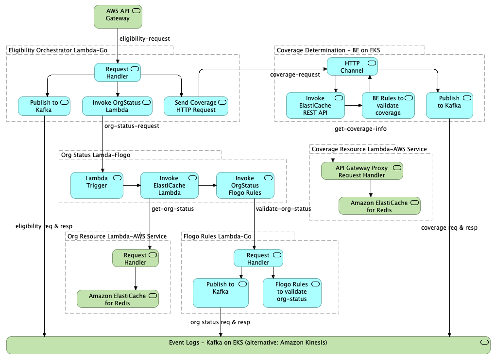

# aws-serverless-app

This Proof of Concept demonstrates a simple application scenario implemented using AWS serverless platform including TIBCO Flogo, Flogo Rules, BusinessEvents, and AWS Golang Lambda functions, Kafka, and Redis cache.

## Solution Design


## Setup development environment

* [Install AWS CLI](https://docs.aws.amazon.com/cli/latest/userguide/install-macos.html#install-bundle-macos)
* [Install AWS SAM CLI](https://docs.aws.amazon.com/serverless-application-model/latest/developerguide/serverless-sam-cli-install-mac.html#serverless-sam-cli-install-mac-homebrew)
* [Install Golang](https://golang.org/doc/install), setup `GOPATH` and prepend `$GOPATH/bin` to `PATH`
* Install TIBCO Flogo and Flogo Rules packages
```bash
go get -u github.com/TIBCOSoftware/flogo-cli/...
go get -u github.com/TIBCOSoftware/flogo-lib
go get -u github.com/project-flogo/rules
```
* Install AWS Go packages
```bash
go get -u github.com/aws/aws-sdk-go/aws
go get -u github.com/aws/aws-sdk-go/aws/session
go get -u github.com/aws/aws-sdk-go/service/lambda
```
* Install other Go packages
```bash
go get -u github.com/Shopify/sarama
go get -u github.com/go-redis/redis
go get -u github.com/google/uuid
```

## Prerequisites

* Configure AWS CLI
Create access key on [IAM Console](https://console.aws.amazon.com/iam/home) if you do not already have a key, and use the access key to configure your AWS CLI environment.
```bash
aws configure
```

## Deploy and start the services

* Create EKS cluster for deploying Kafka and TIBCO BusinessEvents
```bash
./eks/aws/create-all.sh
```
This script creates an EKS cluster according to the configuration defined by `./eks/aws/env.sh`. It also creates an EFS mount, a bastion host, an s3 bucket and a key-pairs for cluster and container management.  It then `ssh` to the bastion host to start a Kafka cluster, and export the connection info in the file `./eks/setup/config/env.sh`.

* Create ElastiCache for Redis
```bash
./elasticache/create-all.sh
```
This script creates a Redis cache cluster, as well as an S3 bucket for Lambda function deployment, and an AWS role for executing Lambda functions.  The connection info are exported in the file `./elasticache/env.sh`.

* Deploy Lambda function for Coverage cache

- `./coverage-reference-app/deploy.sh` - This is a lambda function for GET, PUT, or initialize the Redis cache for coverage. It is used by the coverage service, and so it must be deployed first.

* Deploy TIBCO BE application to EKS

- `./coverage-app/deploy.sh` - This is a container for a coverage service implemented in TIBCO BusinessEvents.  The image is already built and uploaded to AWS ECR, and so the script simply pulls the image from ECR and start the POD and LoadBalancer in the EKS cluster created in the previous step. If you have installed TIBCO BusinessEvents, you may use the scripts in this folder to build the docker image yourself.

* Deploy Lambda functions

- `./org-reference-app/deploy.sh` - This is a lambda function for GET, PUT, or initialize the Redis cache.
- `./flogo-rules-app/deploy.sh` - This is a lambda function for execution of Flogo rules.
- `./flogo-org-status-app/deploy.sh` - This is a lambda function implemented using Flogo UI.
- `./coverage-mock-app/deploy.sh` - This is a lambda function to mock a BE REST service, and will be replaced by a TIBCO BusinessEvents container.
- `./orchestrator-app/deploy.sh` - This is a lamda function for orchestration of all other functions/containers.  If you do not want to start the TIBCO BE container for Coverage, you can use `deploy.sh mock` to start the orchestrator with the `coverage-mock-app`.

## Testing
Each app folder contains a file `test.sh` that shows a sample test case for each function. The same sample test can be submitted using the [AWS Lambda Console](https://us-west-2.console.aws.amazon.com/lambda/home?region=us-west-2#/functions).  Application logs can be viewed on the AWS Lambda Console, or the [CloudWatch Logs](https://us-west-2.console.aws.amazon.com/cloudwatch/home?region=us-west-2#logs:).

To view Coverage container logs, you can find the POD name and then tail its logs using the following command.
```bash
source ./eks/aws/env.sh
kubectl logs -f $(kubectl get pod | grep coverage | awk '{print $1}')
```

## Notes
* Most Lambda functions are develped using Golang, and started by generated code using SAM, e.g.,
```bash
cd path/to/project/root
sam init -r go -n orchestrator-app
```
You can then edit the template.yaml, e.g., add environment variables, and complete the source code.  The code can then be compiled and deployed to AWS using a script similar to `./orchestrator-app/deploy.sh`.

* The Flogo Lambda function is developed using the [Flogo UI](http://www.flogo.io/), which can be started by
```bash
docker run -it -p 3303:3303 flogo/flogo-docker:latest eula-accept
```
When a Flogo flow is complete, you can export the app and download JSON file, which can then be compiled and deployed to AWS using a script similar to `./flogo-org-status-app/deploy.sh`.

* The Redis cluster can be initialized by using the Lamda function implemented in `./org-reference-app/orgdata/redis_cache.go`, which provides a simple init API for creating a specified number of key-value pairs.  Folllowing steps would insert 20 records into the Redis cache for org-status:
```bash
cd ./org-reference-app
./deploy.sh
./test P-000001
```